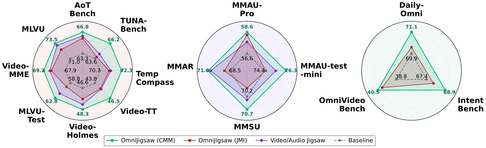
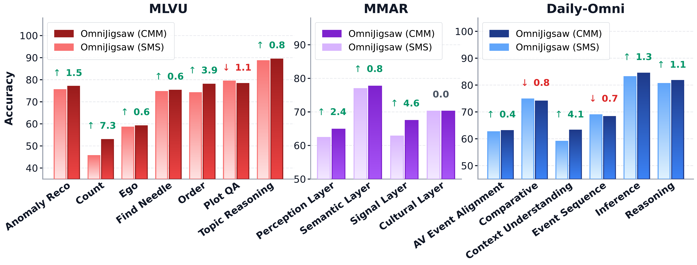
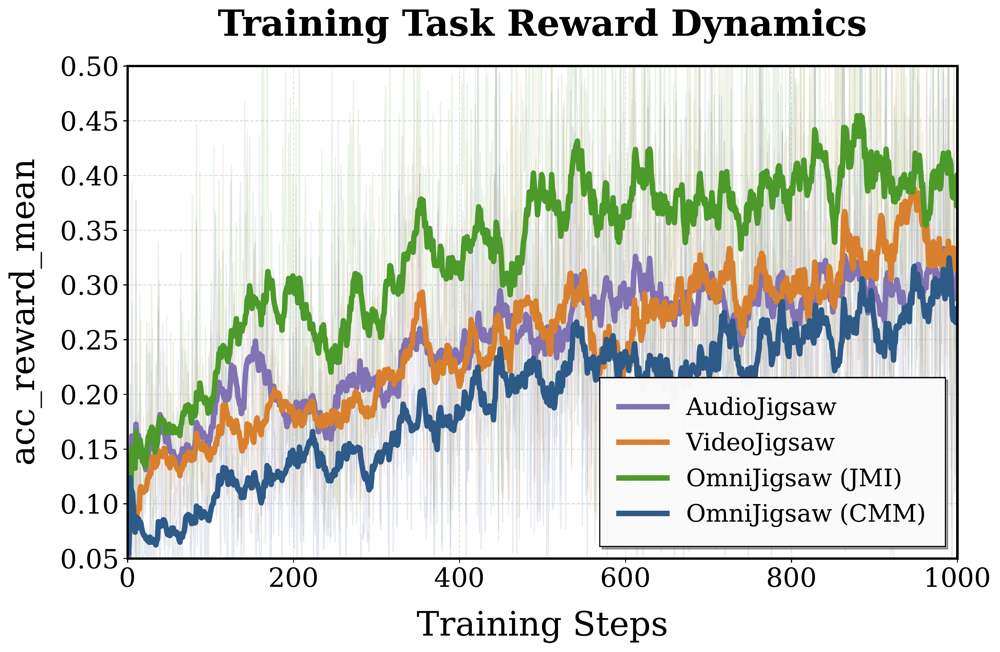
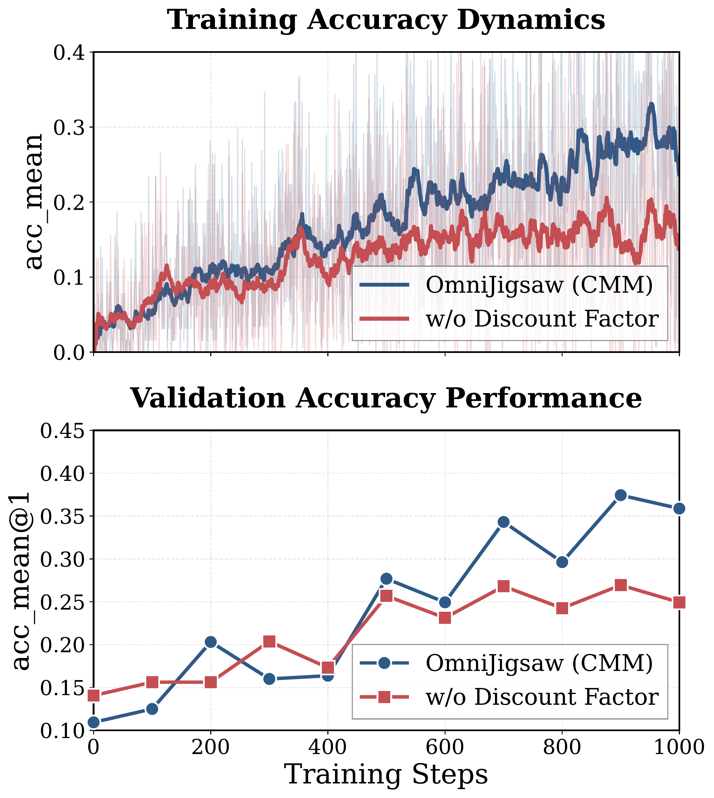
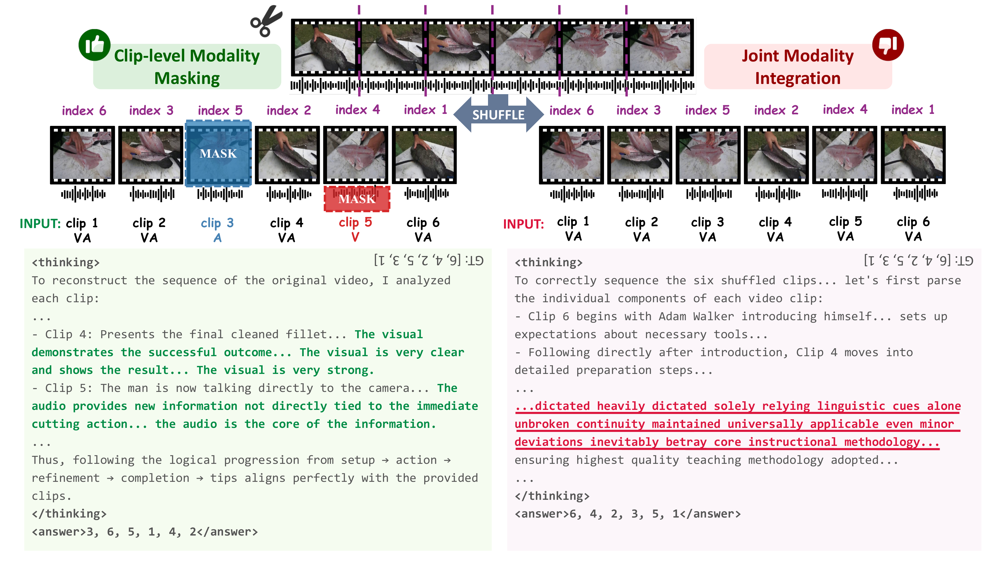
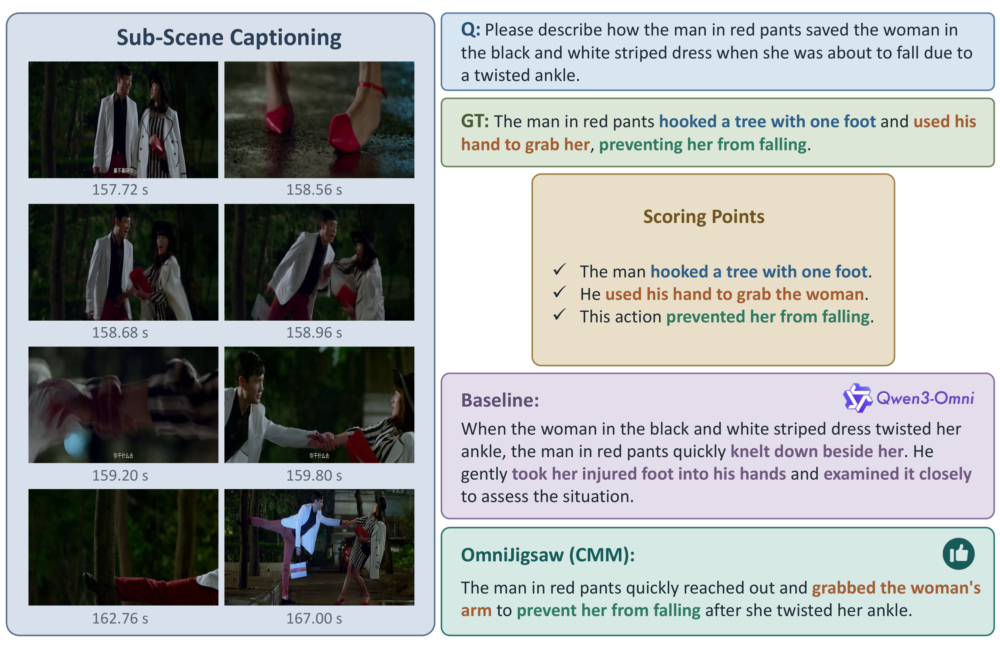
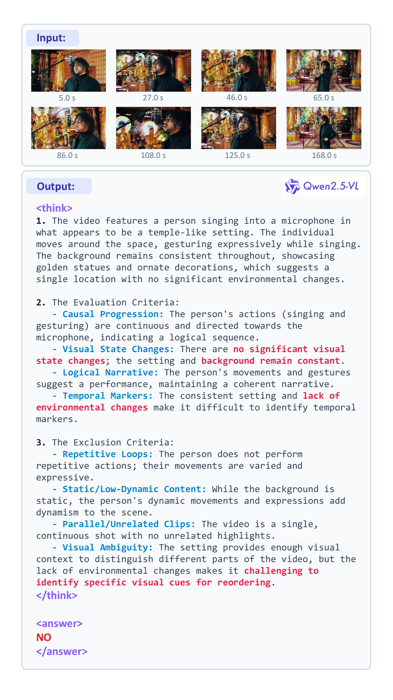
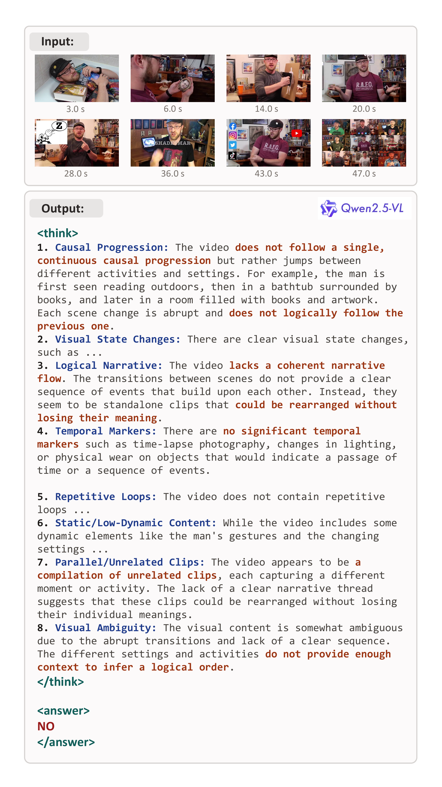

**Yiduo Jia**\*1 · **Muzhi Zhu**\*1 · **Hao Zhong**1 · **Mingyu Liu**1 · **Yuling Xi**1   **Hao Chen**†1 · **Bin Qin**2 · **Yongjie Yang**2 · **Zhenbo Luo**2 · **Chunhua Shen**†1

1 🎓 **Zhejiang University** &nbsp;&nbsp;&nbsp;&nbsp;&nbsp;&nbsp;&nbsp;&nbsp; 2 🏢 **Xiaomi Inc.**  
* Equal contribution &nbsp;&nbsp;&nbsp;&nbsp; † Corresponding authors

 

 

*A self-supervised RL post-training framework that enhances omni-modal reasoning through modality-orchestrated temporal reordering.*

 

## 📖 Abstract

To extend the reinforcement learning post-training paradigm to omni-modal models for concurrently bolstering video-audio understanding and collaborative reasoning, we propose **OmniJigsaw**, a generic self-supervised framework built upon a temporal reordering proxy task. 

Centered on the chronological reconstruction of shuffled audio-visual clips, this paradigm strategically orchestrates visual and auditory signals to compel cross-modal integration through three distinct strategies: **Joint Modality Integration (JMI)**, **Sample-level Modality Selection (SMS)**, and **Clip-level Modality Masking (CMM)**. 

Recognizing that the efficacy of such proxy tasks is fundamentally tied to puzzle quality, we design a two-stage coarse-to-fine data filtering pipeline, facilitating the efficient adaptation of OmniJigsaw to massive unannotated omni-modal data. Extensive evaluations on 15 benchmarks show substantial gains in video, audio, and collaborative reasoning.

## ✨ Highlights

- 🧩 **Self-Supervised Proxy Task:** Pioneers jigsaw-based RL post-training in the omni-modal domain using temporal reordering of shuffled audio-visual clips—requiring zero manual annotation.
- 🎯 **Modality Orchestration:** Three strategies (JMI, SMS, CMM) that govern cross-modal information flow, investigating the bi-modal shortcut phenomenon and compelling deep multi-modal reasoning.
- 🛠️ **Scalable Data Pipeline:** A two-stage coarse-to-fine filtering pipeline (signal-based + semantic CoT screening) that transforms massive unannotated data into high-quality training puzzles.
- 📈 **15 Benchmark Gains:** CMM achieves **+4.38** on MLVU-Test, **+2.50** on MMAR, and **+1.70** on OmniVideoBench over a strong Qwen3-Omni baseline. *(Full quantitative tables are available on our [Project Page](https://HeiXiong620.github.io/OmniJigsaw/))*

 

## 🚀 Framework & Data Pipeline

### OmniJigsaw Strategies
1. **JMI (Baseline):** Retains complete synchronized visual and acoustic information for all clips.
2. **SMS (Intermediate):** Deploys the model as a global dominance analyzer to identify the primary modality per sample.
3. **CMM (Advanced & Best):** Evaluates semantic density per clip and selectively masks the less salient modality, creating a cross-modal information bottleneck.

### Data Filtering
High-quality puzzles are critical for our proxy task. We design a two-stage pipeline: signal-based heuristic filtering ensures omni-modal integrity, followed by semantic-based Chain-of-Thought (CoT) screening for narrative logic and state transitions.

  
   
  <em>Figure: Two-stage coarse-to-fine data filtering pipeline.</em>

 

## 💡 Ablations & Insights

Our extensive analysis reveals several critical insights regarding cross-modal learning dynamics:

1. **Bi-Modal Shortcut Phenomenon:** Under JMI, redundant audio-visual cues allow the model to rely on the dominant modality alone, bypassing deep cross-modal reasoning.
2. **Clip-level > Sample-level:** CMM consistently outperforms SMS, conforming to the dynamic flow of audio-visual information and maximizing local information entropy.
3. **Data Quality is Critical:** Training without the filtering pipeline leads to significant degradation.
4. **Discount Factor as Catalyst:** The accuracy-dependent discount factor suppresses sub-optimal solutions, preventing premature convergence.

*(Specific quantitative ablation results are available on our [Project Page](https://HeiXiong620.github.io/OmniJigsaw/))*

  
    
  
    
  <!-- 以下两张图尺寸缩小，保持居中 -->
  
    
  
    
  <em>Figures (from top to bottom): Radar comparison of strategies, Sub-capability comparison, Task reward dynamics, and Optimization dynamics with/without discount factor.</em>

 

## 🎬 Qualitative Examples

### CoT Reasoning: CMM vs JMI
CMM compels the model to jointly analyze visual and auditory cues by masking less salient modalities, while JMI exhibits a bi-modal shortcut by "solely relying on linguistic cues."

  

### Reasoning Capabilities & Data Filtering Cases

  
  

  
  

  <em>Top: Qualitative improvements in sub-scene captioning and video summarization. Bottom: Rejection cases caught by our semantic data filtering pipeline.</em>

 

  
<em>For more details, please visit our <a href="https://HeiXiong620.github.io/OmniJigsaw/">Project Page</a>.</em>

